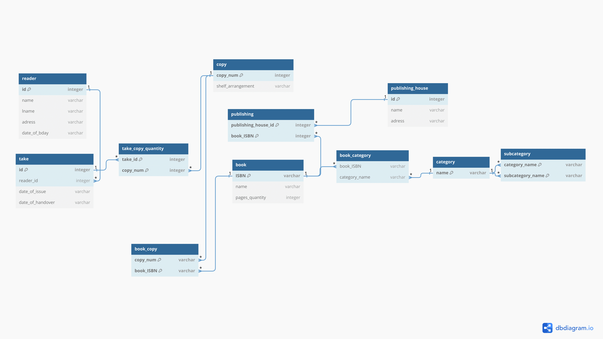
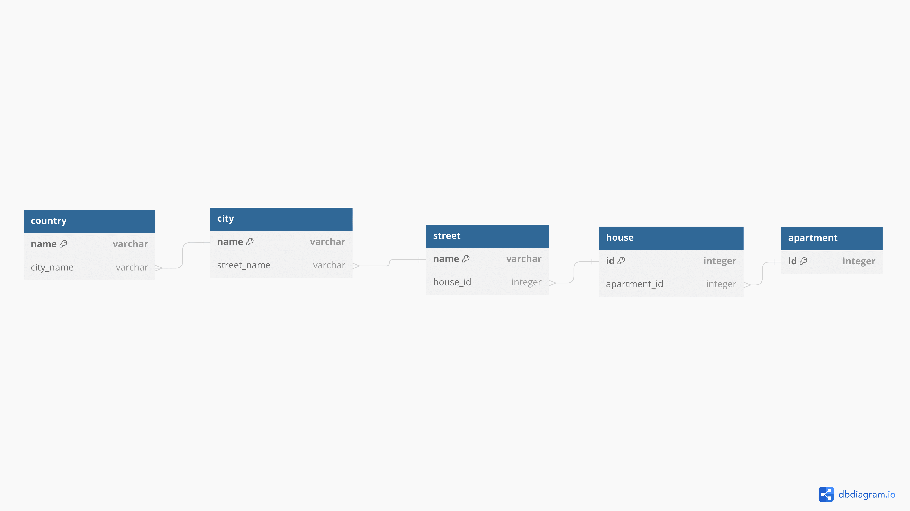
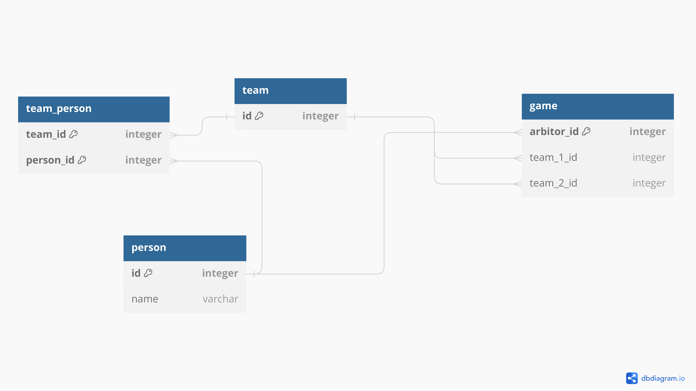
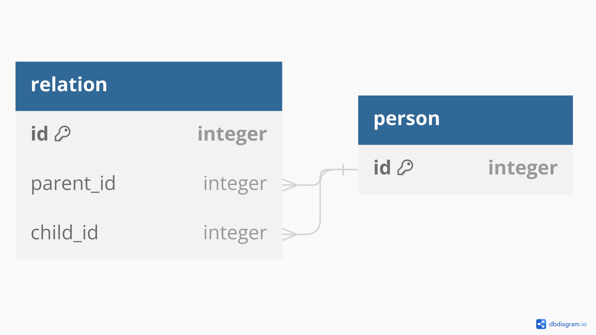

# Задание 2 
#### Переведите все диаграммы ER из предыдущей домашней работы в реляционные схемы

**Задача 1.** 

 * В библиотеки хранятся экземпляры книг. Каждая копия (экземпляр) имеет свой уникальный номер копии, положение на полке и может быть однозначно идентифицирована с помощью номера копии вместе с ISBN. 

 * Каждая книга имеет уникальный номер ISBN, год, название, автора и количество страниц. 

 * Книги издаются издательствами. У издателя есть имя и адрес. 

 * В библиотечной системе книгам присвоена одна категория или несколько. Категории образуют иерархию, поэтому категория может быть просто другой подчиненой категорией (подкатегория). Категория имеет только имя и никаких других свойств. 

 * Каждому читателю присваивается уникальный номер. У читателя есть Фамилия, Имя, адрес и день рождения. Читатель может взять один или несколько экземпляров книг. При взятии книги записывается запланированая дата возврата.  

**copy**

1 **copy\_num integer**

**reader**

**integer** 1 shelf\_arrangement varchar **publishing\_house**

**id**

name varchar 1 **id integer** lname varchar name varchar

**publishing**

adress varchar \* adress varchar

**publishing\_house\_id integer**

date\_of\_bday varchar **integer** \*

**book\_ISBN**

**take\_copy\_quantity**

**book\_category subcategory**

**take** \* **take\_id integer**

**book** \* book\_ISBN **category** \* **category\_name varchar id integer** 1 **copy\_num integer** \* varchar 1 **name varchar** 1 \*

\* 1 **ISBN varchar** 1 category\_name varchar \* **subcategory\_name varchar**

reader\_id integer

name varchar

date\_of\_issue varchar

pages\_quantity integer

date\_of\_handover varchar

**book\_copy**

**copy\_num varchar** \* **book\_ISBN varchar** \*

 **Задача 2.** 

  *  Квартира расположена в доме на улице в городе в стране

**country city**

**name varchar** 1 **name varchar street house apartment** city\_name varchar \* street\_name varchar \* 1 **name varchar** 1 **id integer** 1 **id integer**

house\_id integer \* apartment\_id integer \*

  *  Две команды играют друг против друга в футбол под руководством арбитра
 
 **team**

**team\_person game**

1 **id integer** 1

**team\_id integer** \* \* **arbitor\_id integer person\_id integer** \* \* team\_1\_id integer

\* team\_2\_id integer

**person**

**id integer** 1 name varchar

  *  У каждого человека (мужчины и женщины) есть отец и мать

**relation**

**person**

**id integer**

1 **id integer**

parent\_id integer \*

child\_id integer \*
