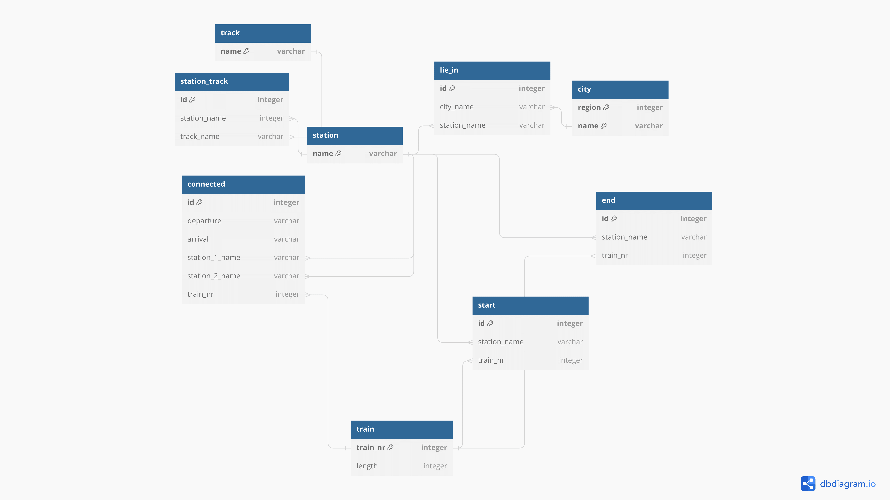
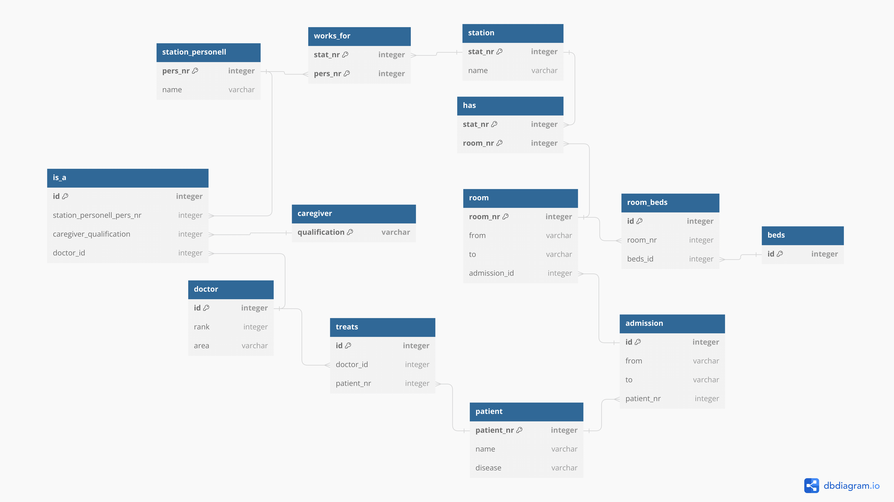

# Задание 1
**Вопрос:** Почему любое отношение в реляционной схеме имеет по крайней мере один ключ?

**Ответ:** В реляционной модели данных ключом называется атрибут или комбинация атрибутов, которые однозначно идентифицируют каждую запись в отношении. Ключ служит для обеспечения уникальности записей в отношении и является основой для построения связей между разными отношениями.

Каждая запись в отношении должна быть уникальна, чтобы можно было однозначно идентифицировать и получать доступ к ней. Поэтому любое отношение должно иметь по крайней мере один ключ.

При этом, в отношении может быть несколько альтернативных ключей, каждый из которых также однозначно идентифицирует записи. Но по крайней мере один из них должен быть выбран в качестве первичного ключа, который будет использоваться для связей с другими отношениями.

# Задание 2
#### Переведите все диаграммы ER из предыдущей домашней работы в реляционные схемы

**Задача 1.** 

 * В библиотеки хранятся экземпляры книг. Каждая копия (экземпляр) имеет свой уникальный номер копии, положение на полке и может быть однозначно идентифицирована с помощью номера копии вместе с ISBN. 

 * Каждая книга имеет уникальный номер ISBN, год, название, автора и количество страниц. 

 * Книги издаются издательствами. У издателя есть имя и адрес. 

 * В библиотечной системе книгам присвоена одна категория или несколько. Категории образуют иерархию, поэтому категория может быть просто другой подчиненой категорией (подкатегория). Категория имеет только имя и никаких других свойств. 

 * Каждому читателю присваивается уникальный номер. У читателя есть Фамилия, Имя, адрес и день рождения. Читатель может взять один или несколько экземпляров книг. При взятии книги записывается запланированая дата возврата.  

****

 **Задача 2.** 

  *  Квартира расположена в доме на улице в городе в стране

****

  *  Две команды играют друг против друга в футбол под руководством арбитра
 
 ****

  *  У каждого человека (мужчины и женщины) есть отец и мать

****

# Задание 3
Переведите приведенные диаграммы ER в реляционные схемы.  
3.1. https://imgur.com/w2iDI1o  

****

3.2. https://imgur.com/oFBM5pp

****
